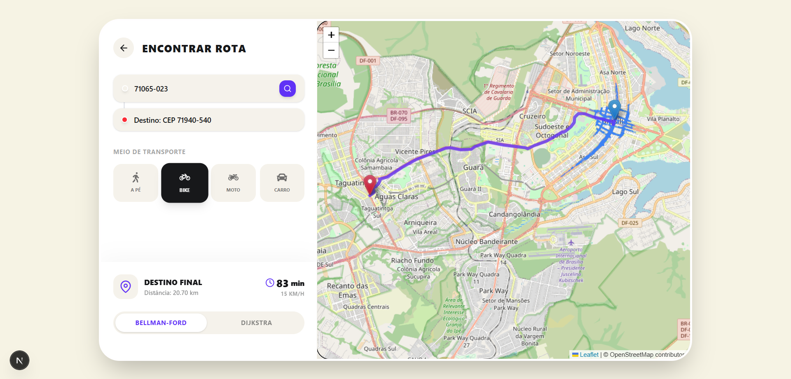

# Delivery Routing com Grafos - Stock.io


*Figura 1: Visão geral da tela inicial*

Este projeto foi desenvolvido para a disciplina de **Projeto de Algoritmos (PA) - 2026.2**, com foco na aplicação prática de teoria de grafos no mundo real.

A aplicação simula um sistema de rotas de entrega (delivery) para a plataforma **stock.io**, conectando pontos geográficos reais através do **OpenStreetMap**, extraindo a malha viária e calculando a rota mais curta e viável utilizando os algoritmos de **Dijkstra** e **Bellman-Ford**.

## Tecnologias Utilizadas

O projeto está dividido em duas partes principais:

### Frontend
- **Framework:** [Next.js](https://nextjs.org/) com React 18
- **Linguagem:** TypeScript
- **Estilização:** TailwindCSS
- **Mapas:** Leaflet + React-Leaflet
- **Geocoding:** ViaCEP + Nominatim (Busca avançada com fallback estruturado)

### Backend
- **Framework:** [FastAPI](https://fastapi.tiangolo.com/)
- **Linguagem:** Python 3.11+
- **ORM:** Prisma Client Python
- **Banco de Dados:** SQLite (via Prisma)

---

## Funcionalidades e Algoritmos

* **Geocodificação Inteligente:** O sistema aceita a entrada de CEPs e utiliza múltiplas APIs (ViaCEP + Nominatim) para traçar as exatas coordenadas de ruas e bairros brasileiros de forma dinâmica e resiliente.
* **Mapeamento em Tempo Real:** Conexão direta com a API do **Overpass / OSM** para extrair a malha viária (ruas, rodovias, avenidas) baseada na distância entre a Origem e o Destino.
* **Algoritmo de Dijkstra:** Implementação clássica com fila de prioridades para encontrar o caminho mais rápido com pesos não-negativos.
* **Algoritmo de Bellman-Ford:** Implementação em Python (backend) e TypeScript (frontend) com suporte a verificação de ciclos negativos e otimização de *early stopping*.
* **Visualização Animada:** Ao calcular a rota, a interface projeta e anima o processo de "exploração" do algoritmo pelos caminhos do grafo até a descoberta da rota ideal.

---

## Comparação de Eficiência: Dijkstra x Bellman-Ford

Na plataforma **stock.io**, oferecemos a visualização e execução de dois dos mais importantes algoritmos de caminho mínimo. Como nosso grafo representa uma malha viária do mundo real (onde as distâncias são estritamente positivas), podemos observar uma diferença brutal na eficiência:

### Dijkstra
- **Complexidade de Tempo:** O(V log V + E) ou O(V^2), dependendo da estrutura de fila de prioridade utilizada.
- **Vantagem no Mapa:** É extremamente rápido e eficiente para mapas de ruas. Ele se expande geograficamente em formato de "diamante" (buscando em largura a partir da origem), processando apenas os nós mais promissores.
- **Uso Prático:** Para distâncias geográficas longas (acima de 15km), o Dijkstra encontra a rota em milissegundos.


*Figura 2: Cálculo de rota utilizando o algoritmo de Bellman-Ford.*

### Bellman-Ford
- **Complexidade de Tempo:** O(V * E).
- **Desvantagem no Mapa:** Ele relaxa **todas** as arestas do mapa, repetidas vezes (até V-1). Num grafo de cidade com milhares de nós (esquinas) e arestas (ruas), isso resulta em milhões de operações computacionais desnecessárias, já que não temos ruas com "distância negativa".
- **Otimização Implementada:** Para viabilizar a demonstração do Bellman-Ford no navegador sem travamentos, implementamos um *Early Stopping* (parada antecipada). O algoritmo interrompe o laço caso nenhuma distância seja relaxada durante uma iteração inteira, cortando o processamento exponencial pela metade em cenários lineares. Ainda assim, é visivelmente mais lento que o Dijkstra na animação de exploração do mapa.

---

## Como Configurar e Executar

Siga as instruções abaixo para rodar o projeto localmente na sua máquina.

### 1. Clonando o repositório

```bash
git clone https://github.com/projeto-de-algoritmos-2026/G7_Grafos_PA-26.2.git
cd G7_Grafos_PA-26.2
```

### 2. Configurando o Backend (Python / FastAPI)

Abra um terminal e navegue até a pasta `backend`:

```bash
cd backend
```

1. **Crie um ambiente virtual e ative-o:**
   - No Windows:
     ```bash
     python -m venv venv
     .\venv\Scripts\activate
     ```
   - No Linux/Mac:
     ```bash
     python3 -m venv venv
     source venv/bin/activate
     ```

2. **Instale as dependências:**
   ```bash
   pip install -r requirements.txt
   ```

3. **Configure o Banco de Dados (Prisma):**
   Gere os schemas e sincronize com o SQLite:
   ```bash
   prisma generate
   prisma db push
   ```

4. **Inicie o servidor local:**
   ```bash
   uvicorn app.main:app --reload --port 8000
   ```
   > A API estará rodando em `http://localhost:8000`. Você pode acessar a documentação interativa em `http://localhost:8000/docs`.

### 3. Configurando o Frontend (Node / Next.js)

Abra **outro** terminal e navegue até a pasta `frontend`:

```bash
cd frontend
```

1. **Instale as dependências:**
   ```bash
   npm install
   ```

2. **Inicie o servidor de desenvolvimento:**
   ```bash
   npm run dev
   ```

3. **Acesse a aplicação:**
   Abra o seu navegador e acesse [http://localhost:3000](http://localhost:3000).

---

## Como usar a aplicação

### Credenciais de Acesso (Testes)
Para acessar o sistema, você pode utilizar os seguintes usuários já cadastrados:

**Cliente**
- **Email:** mauricio@gmail.com
- **Senha:** mauricio123@

**Entregador**
- **Email:** mauricioentregador@gmail.com
- **Senha:** mauricio123@

### Passo a Passo da Aplicação
1. Faça login utilizando uma das credenciais acima
2. Realize o pedido de um item na plataforma
3. Acesse a plataforma como entregador
4. Escolha um pedido
5. Calcule a rota do pedido com o algoritmo escolhido

## Equipe

| Foto | Nome |
| :---: | :--- |
|  | **Johnnatan Salles** |
|  | **Julia Gabriella** |
